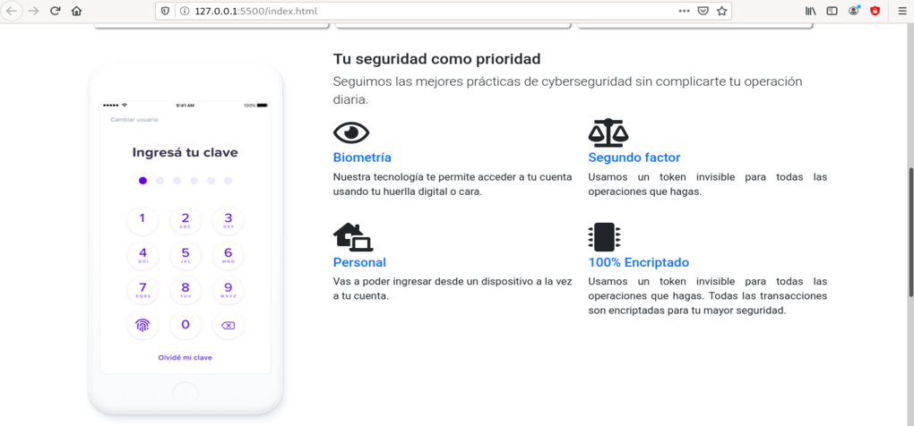
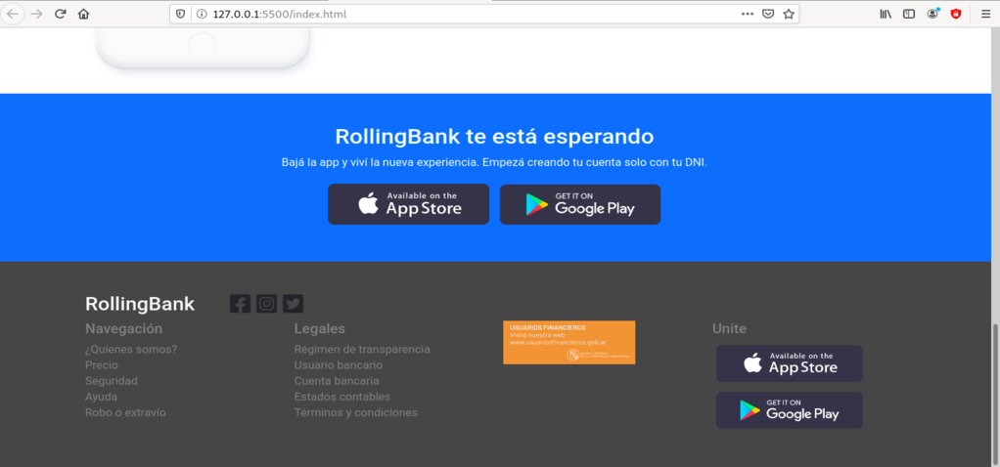

# Web development - Frontend
Web page layout using **HTML, CSS, Bootstrap and Javascript**. This template is designed to a Bank which is a project to Rolling Code School according to the training to Web FullStack developer.

## Navbar and slider

## Main with cards

## Footer

The full project contains four aditionals web pages which include information, images and links according to the layout.
